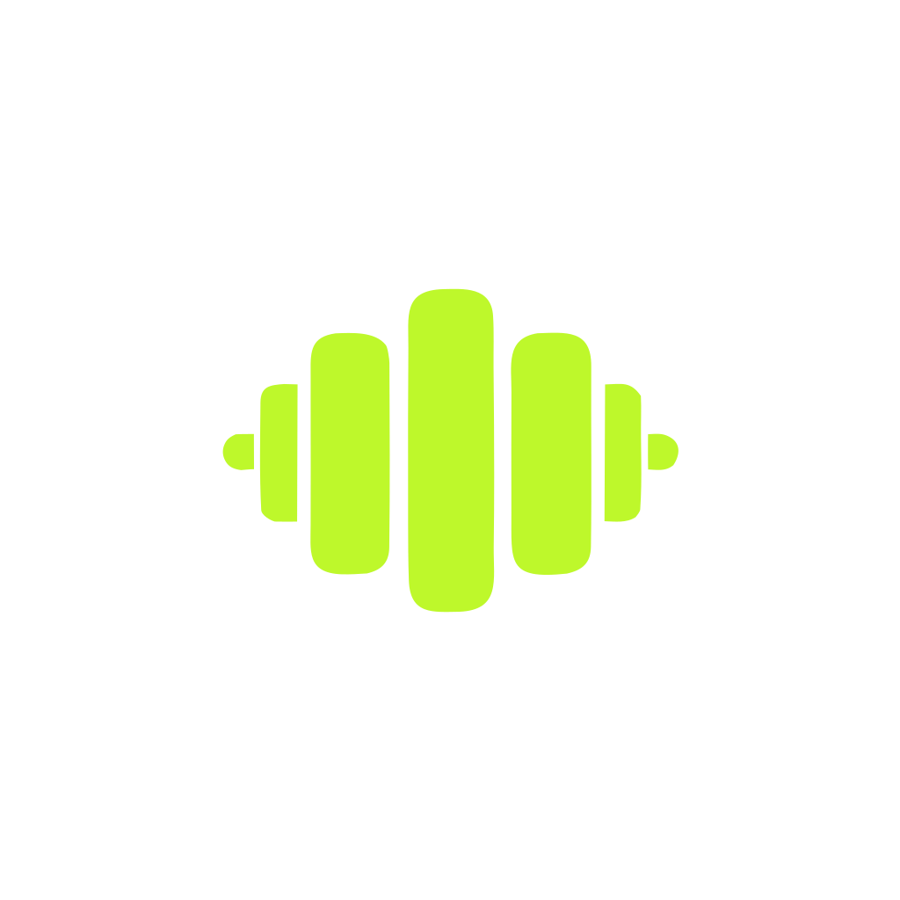

<p align="center">
  
</p>

<h1 align="center">METRI Web · metri.info</h1>

<p align="center">
  The open-source web companion to the
  <a href="https://github.com/Ricwolf19/metri">METRI</a> mobile fitness app —
  free calculators, an exercise library, training programs and an
  evidence-based knowledge base.<br />
  Dark-first, bilingual (EN/ES), SEO-first, and built to mirror the mobile app 1:1.
</p>

<p align="center">
  
  
  
  
</p>

## Features

- **8 fitness calculators** — 1RM, TDEE/BMR, macros, body fat (Navy), BMI, FFMI,
  hydration and barbell plates. Same formulas as the app, instant in-browser.
  Inputs live in the URL, so every result is shareable as a link or QR code —
  no account, no stored state.
- **Exercise library** — form guides with target muscles, equipment and
  step-by-step technique; filterable by muscle group and equipment.
- **Training programs** — multi-week routines with per-day exercises, sets/reps.
- **Knowledge base** — MDX guides on nutrition, training and recovery with search.
- **Bilingual** — English at the root, Spanish under `/es` with localized slugs
  and reciprocal hreflang.
- **Advanced SEO** — static generation, per-page metadata, JSON-LD, dynamic OG
  images, sitemap + robots. See [`docs/seo`](./docs/seo).

## Tech stack

| Layer | Choice |
|-------|--------|
| Framework | Next.js 16 (App Router, React 19, RSC) |
| Package manager / runner | Bun |
| Styling | Tailwind CSS v4 (CSS-first `@theme`) |
| Animation | Framer Motion |
| Icons | Iconoir (`@/components/icons` barrel) |
| Content | MDX (`next-mdx-remote`) |
| Database | Drizzle ORM + Neon (Postgres) — *optional, for accounts* |
| Auth | Better Auth — *optional* |
| Analytics | Vercel Analytics + Speed Insights, optional GA4 |

The **calculators, exercises, programs and docs are bundled static content** —
they need no database and render as static HTML. The DB + auth layer powers
accounts and saved history and activates only when configured.

## Getting started

```bash
bun install
bun run dev        # http://localhost:3000

bun run build      # production build
bun run verify     # format + lint + typecheck + circular-deps + build
bun run knip       # dead-code / dependency check
```

Copy `.env.example` → `.env.local`. The site runs fully without any env vars;
see [`docs/SETUP.md`](./docs/SETUP.md) to wire up Neon, Better Auth, GA4 and
Search Console.

## Architecture

- **i18n routing** — two explicit route trees (`/` and `/es`) sharing components.
  Locale is derived from the URL; the central route map (`lib/i18n/routes.ts`)
  drives nav, the language switcher, hreflang and the sitemap. Server Components
  receive `locale` as a prop (via `createT`) so every page is statically
  generated in both languages.
- **Design tokens** — ported 1:1 from mobile (`ink-*` scale, lime `#bef82b`
  accent) as CSS variables that swap per theme. Never hardcode hex.
- **Calculators** — pure formulas in `lib/calculations`; a config-driven registry
  (`lib/calculators`) renders all 8 from one tested client island.
- **No global state** — Server Components fetch/render directly; client state is
  URL params + React Context.

## Project structure

```
app/              App Router routes (EN at root, ES under /es) + SEO files
components/       icons, layout, marketing, shared, docs, calculators, exercises, programs, seo
content/docs/     MDX knowledge base (en/es)
lib/              i18n, theme, calculations, calculators, exercises, programs, db, auth, seo, og
docs/             SEO playbook (EN/ES) + service setup guide
drizzle/          generated migrations (after db:generate)
```

## Scripts

`dev` · `build` · `start` · `lint` · `typecheck` · `format` · `knip` ·
`lint:circular` · `verify` (CI gate) · `gen:favicons` ·
`db:generate` / `db:migrate` / `db:push` / `db:studio` / `db:seed`.

## License

MIT.
